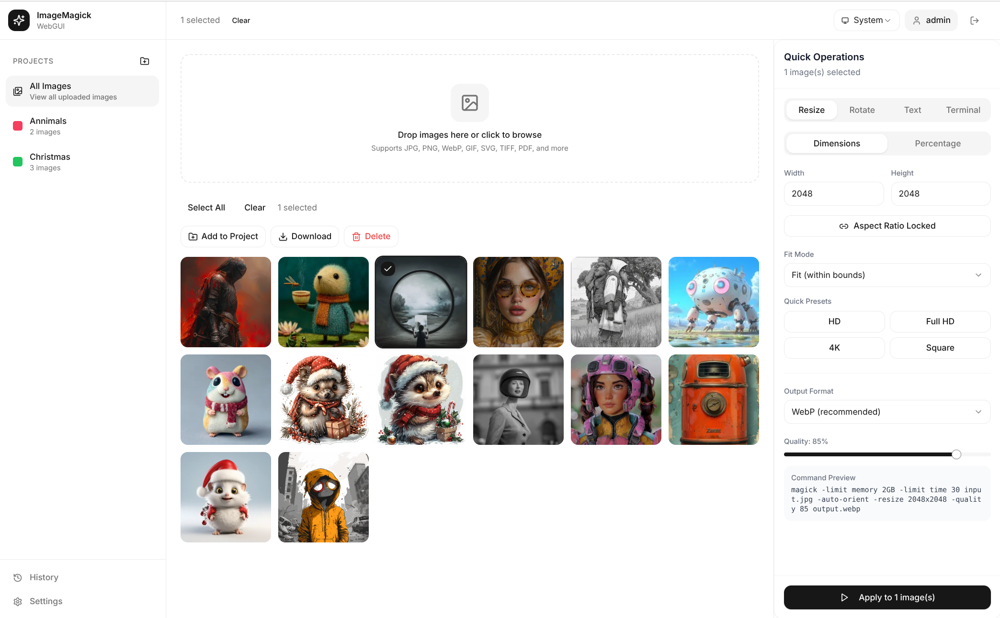
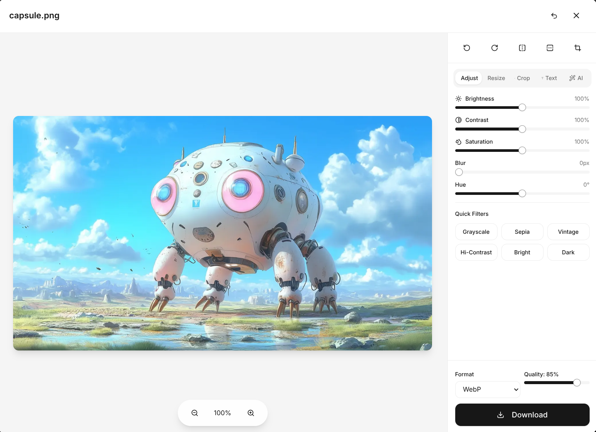
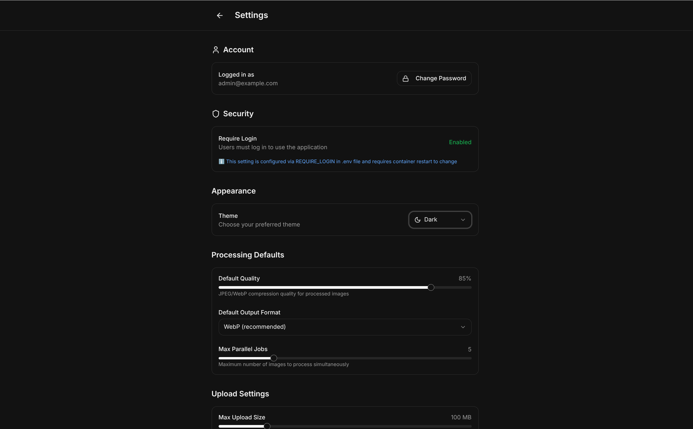
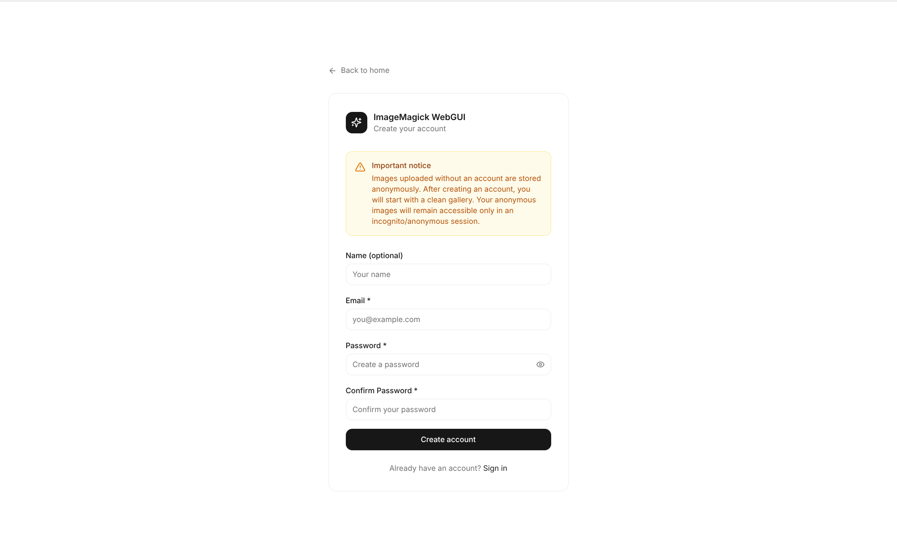
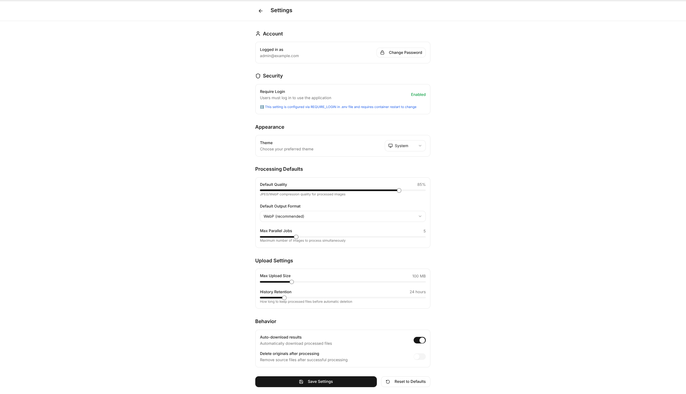

<div align="center">

 

# ImageMagick WebGUI

<br/>
</div>

<div align="center">

[](https://github.com/PrzemekSkw/imagemagick-webui/stargazers)
[](https://github.com/PrzemekSkw/imagemagick-webui/network/members)
[](https://github.com/PrzemekSkw/imagemagick-webui/issues)
[](https://github.com/PrzemekSkw/imagemagick-webui/blob/main/LICENSE)
[](https://hub.docker.com/r/przemekskw/imagemagick-webui)

**A modern, beautiful web interface for ImageMagick with AI-powered features**

[Features](#-features) • [Quick Start](#-quick-start) • [Documentation](#-documentation) • [Screenshots](#-screenshots) • [Contributing](#-contributing)

</div>

## 📽️  Video

https://github.com/user-attachments/assets/53538ac9-8642-4c9b-972f-772c17efa9fa

---

## ✨ Features

### 🎨 Image Processing
- **Resize & Crop** - Precise dimensions, percentage scaling, aspect ratio lock
- **Format Conversion** - WebP, AVIF, JPEG, PNG, GIF, TIFF, PDF support
- **Filters & Effects** - Blur, Sharpen, Grayscale, Sepia, Brightness, Contrast, Saturation
- **Watermark & Text** - Custom text overlays with position, opacity, and font size control
- **Rotate & Flip** - 90°, 180°, 270° rotation with horizontal/vertical flip
- **Batch Processing** - Process multiple images simultaneously

### 🤖 AI-Powered Features
- **Background Removal** - One-click AI background removal using rembg
- **Auto Enhance** - Automatic image enhancement (normalize, saturation, sharpening)
- **Smart Upscaling** - 2x/4x resolution upscaling with LANCZOS algorithm

### 🖥️ User Interface
- **Notion-inspired Design** - Ultra-clean, minimalist white interface
- **Real-time Preview** - See changes before applying
- **Drag & Drop Upload** - Easy multi-file upload
- **Image Editor** - Full-featured editor with live preview
- **Terminal Mode** - Direct ImageMagick command input for power users
- **Dark/Light Mode** - Automatic or manual theme switching
- **PWA Support** - Install as desktop/mobile app

### 🔧 Technical
- **Docker Ready** - One command deployment
- **Type-Safe** - Full TypeScript + Pydantic validation
- **Secure** - Command whitelist, timeouts, resource limits
- **Queue System** - Redis-based job queue for heavy operations
- **History** - Track all processed images with re-download option

---

## 🚀 Quick Start

### Prerequisites
- [Docker](https://docs.docker.com/get-docker/) 20.10+ and [Docker Compose](https://docs.docker.com/compose/install/) 2.0+

### Option 1: Using Docker Image (Recommended)
```bash
# Create project directory
mkdir imagemagick-webgui && cd imagemagick-webgui

# Download docker-compose file
curl -O https://raw.githubusercontent.com/PrzemekSkw/imagemagick-webui/main/docker-compose.example.yml
mv docker-compose.example.yml docker-compose.yml

# Start the application
docker compose up -d
```

**That's it!** Open [http://localhost:3000](http://localhost:3000) in your browser.

### Option 2: Build from Source
```bash
git clone https://github.com/PrzemekSkw/imagemagick-webui.git
cd imagemagick-webgui
cp .env.example .env
docker compose up --build -d
```

> ⚠️ **Important**: Change `SECRET_KEY` in docker-compose.yml before deploying to production!


Open http://localhost:3000


### Default Ports
| Service | Port | Description |
|---------|------|-------------|
| Frontend | 3000 | Next.js web interface |
| Backend | 8000 | FastAPI REST API |
| PostgreSQL | 5432 | Database |
| Redis | 6379 | Queue system |

---

## 📖 Documentation

### Configuration

Create a `.env` file in the project root (optional):

```env
# Database
DATABASE_URL=postgresql+asyncpg://imagemagick:imagemagick@db:5432/imagemagick

# Security
SECRET_KEY=your-secret-key-change-in-production
ACCESS_TOKEN_EXPIRE_MINUTES=60

# ImageMagick limits
IMAGEMAGICK_TIMEOUT=60
IMAGEMAGICK_MEMORY_LIMIT=2GB
MAX_UPLOAD_SIZE=50MB

# Optional: Google OAuth
GOOGLE_CLIENT_ID=your-google-client-id
GOOGLE_CLIENT_SECRET=your-google-client-secret
```

### API Documentation

Once running, access the interactive API docs:
- **Swagger UI**: [http://localhost:8000/docs](http://localhost:8000/docs)
- **ReDoc**: [http://localhost:8000/redoc](http://localhost:8000/redoc)

### Architecture

```
┌─────────────────┐     ┌─────────────────┐
│   Next.js 15    │────▶│    FastAPI      │
│   (Frontend)    │     │   (Backend)     │
│   Port: 3000    │     │   Port: 8000    │
└─────────────────┘     └────────┬────────┘
                                 │
                    ┌────────────┴────────────┐
                    │                         │
              ┌─────▼─────┐           ┌───────▼───────┐
              │ PostgreSQL│           │     Redis     │
              │   (DB)    │           │   (Queue)     │
              │ Port: 5432│           │  Port: 6379   │
              └───────────┘           └───────────────┘
                                              │
                                      ┌───────▼───────┐
                                      │  RQ Worker    │
                                      │ (Background)  │
                                      └───────────────┘
```

### Supported Operations

| Operation | Parameters | Example |
|-----------|------------|---------|
| `resize` | `width`, `height`, `percent`, `fit` | `{"width": 800, "height": 600}` |
| `crop` | `x`, `y`, `width`, `height` | `{"x": 0, "y": 0, "width": 500, "height": 500}` |
| `rotate` | `degrees` | `{"degrees": 90}` |
| `flip` | `direction` | `{"direction": "horizontal"}` |
| `blur` | `sigma` | `{"sigma": 10}` |
| `sharpen` | `sigma` | `{"sigma": 2}` |
| `brightness` | `value` | `{"value": 120}` |
| `contrast` | `value` | `{"value": 110}` |
| `saturation` | `value` | `{"value": 130}` |
| `grayscale` | - | `{}` |
| `sepia-tone` | `threshold` | `{"threshold": 80}` |
| `watermark` | `text`, `position`, `font_size`, `opacity` | `{"text": "©2024", "position": "southeast"}` |
| `format` | `format`, `quality` | `{"format": "webp", "quality": 85}` |

### Terminal Mode Commands

For advanced users, use Terminal Mode to run raw ImageMagick commands:

```bash
# Convert to WebP with quality
magick input.jpg -quality 80 output.webp

# Create thumbnail
magick input.jpg -thumbnail 300x300 output.jpg

# Add border
magick input.jpg -border 10x10 -bordercolor "#ff0000" output.jpg

# Composite images
magick base.jpg overlay.png -composite output.jpg
```

---

## 📸 Screenshots

<details>
<summary>Click to view screenshots</summary>

### Dashboard


### Image Editor


### Dark Mode


### Login Page


### Register Page


### Settings

</details>

---

## 🛠️ Development

### Local Development (without Docker)

**Backend:**
```bash
cd backend
python -m venv venv
source venv/bin/activate  # Windows: venv\Scripts\activate
pip install -r requirements.txt
uvicorn app.main:app --reload --port 8000
```

**Frontend:**
```bash
cd frontend
npm install
npm run dev
```

### Running Tests

```bash
# Backend tests
cd backend
pytest

# Frontend tests
cd frontend
npm test
```

### Project Structure

```
imagemagick-webui/
├── backend/
│   ├── app/
│   │   ├── api/          # API endpoints
│   │   ├── core/         # Config, security, database
│   │   ├── models/       # SQLAlchemy models
│   │   ├── services/     # Business logic
│   │   └── workers/      # Background tasks
│   ├── tests/
│   └── requirements.txt
├── frontend/
│   ├── app/              # Next.js App Router pages
│   ├── components/       # React components
│   │   ├── features/     # Feature components
│   │   ├── layout/       # Layout components
│   │   └── ui/           # UI primitives (shadcn/ui)
│   └── lib/              # Utilities, API client, store
├── docker-compose.yml
├── Dockerfile
└── README.md
```

---

## 🔒 Security

- **Command Whitelist** - Only allowed ImageMagick operations
- **Input Validation** - Pydantic models for all inputs
- **Resource Limits** - Memory (2GB), timeout (60s), disk limits
- **File Validation** - MIME type and extension checking
- **Rate Limiting** - Configurable request limits
- **Non-root Container** - Runs as unprivileged user

---

## 🤝 Contributing

Contributions are welcome! Please read our [Contributing Guide](CONTRIBUTING.md) for details.

1. Fork the repository
2. Create your feature branch (`git checkout -b feature/amazing-feature`)
3. Commit your changes (`git commit -m 'Add amazing feature'`)
4. Push to the branch (`git push origin feature/amazing-feature`)
5. Open a Pull Request

---

## 📄 License

This project is licensed under the MIT License - see the [LICENSE](LICENSE) file for details.

---

## 💖 Support

If you find this project useful, you can support its development:

**Support via BuyMeACoffee:**

[](https://www.buymeacoffee.com/przemekskw)

**Support via PayPal:**

[](https://paypal.me/przemekskw)

**Support via GitHub Sponsors:**

[](https://github.com/sponsors/PrzemekSkw)

Your support helps maintain and improve this project. Thank you! ❤️

---

## ⭐ Star on GitHub

If you find this project useful, please consider giving it a star on GitHub!

## Star History

[](https://www.star-history.com/#PrzemekSkw/imagemagick-webui&type=date&legend=top-left)

---

## 🙏 Acknowledgments

- [ImageMagick](https://imagemagick.org/) - The powerful image processing library
- [rembg](https://github.com/danielgatis/rembg) - AI background removal
- [Next.js](https://nextjs.org/) - React framework
- [FastAPI](https://fastapi.tiangolo.com/) - Python web framework
- [shadcn/ui](https://ui.shadcn.com/) - Beautiful UI components
- [Tailwind CSS](https://tailwindcss.com/) - Utility-first CSS

---

<div align="center">


Made with ❤️ by [PrzemekSkw](https://github.com/PrzemekSkw)

</div>
